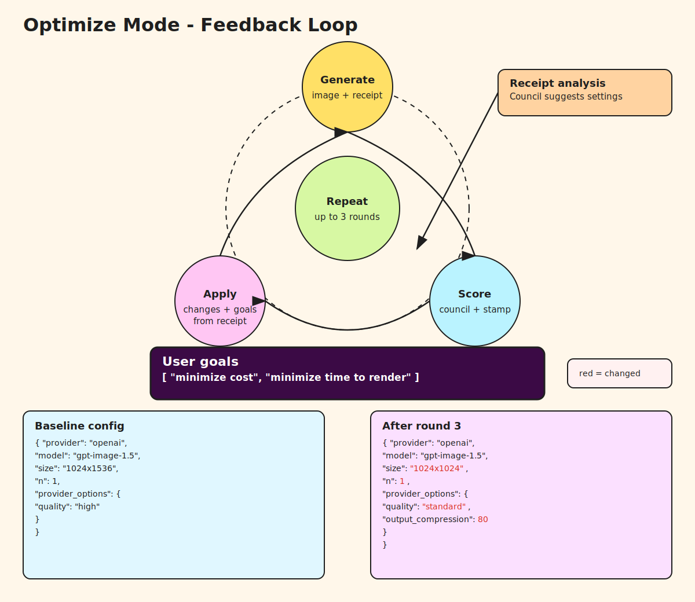

# PARAM FORGE

Interactive terminal UI for multi-provider image generation and receipts.


## TL;DR
PARAM FORGE is a terminal UI for running text-to-image jobs across providers and saving reproducible receipts next to outputs.



## Use cases
- compare providers or models for a prompt set
- iterate on prompt, size, and seed quickly
- keep a local paper trail of inputs and parameters

## Outputs
- images and receipt files written to the output directory
- receipts capture the prompts and provider parameters used
- receipt metadata includes render timing and LLM scoring (adherence/quality) when available
- local receipt viewer can render a grid view for quick comparison

## Requirements
- Python 3.10+
- A TTY terminal (macOS Terminal.app, iTerm, etc.)
- Base deps: `pip install -r requirements.txt`
- Provider SDKs (install only what you need):
  - OpenAI: `pip install -r requirements-openai.txt`
  - Gemini/Imagen: `pip install -r requirements-google.txt`
  - Flux (BFL): `pip install -r requirements-flux.txt`
- Receipt analyzers (optional): `pip install -r requirements-analyzers.txt`

## Quick start
```bash
git clone git@github.com:kevinshowkat/param_forge.git
cd param_forge
python -m venv .venv
source .venv/bin/activate
pip install -U pip
pip install -r requirements.txt
# Provider SDKs (choose what you need)
pip install -r requirements-openai.txt
pip install -r requirements-google.txt
pip install -r requirements-flux.txt
# Receipt analyzers (optional)
pip install -r requirements-analyzers.txt

python scripts/param_forge.py
```

## API keys
Set the key for the provider you plan to use. You can export env vars or create a local `.env` file.

- OpenAI: `OPENAI_API_KEY`
- Anthropic (receipt analyzer default): `ANTHROPIC_API_KEY`
- Gemini: `GEMINI_API_KEY` (or `GOOGLE_API_KEY`)
- Flux: `BFL_API_KEY` (or `FLUX_API_KEY`)
- Imagen: `GOOGLE_API_KEY` or Vertex credentials (for example `GOOGLE_APPLICATION_CREDENTIALS`)

Tip: If you run with the OpenAI provider and no key is found, the script will prompt you to set one and can save it to `.env`.
Note: OpenAI image generation models (gpt-image-1.5 / gpt-image-1-mini / gpt-image-1) may require API organization verification to access image generation.

## Usage
Interactive (default when no args are provided):
```bash
python scripts/param_forge.py
```

Explicit interactive:
```bash
python scripts/param_forge.py --interactive
```

Non-interactive defaults:
```bash
python scripts/param_forge.py --defaults
```

Batch run (CLI subcommand is `experiment`):
```bash
python scripts/param_forge.py experiment \
  --prompts prompts.txt \
  --matrix matrix.yaml \
  --out runs/food_glam_v1
```

Prompt selection (interactive):
- The Explore flow includes a **Prompt** step.
- Press Enter with no input to use the default prompt.

Receipt viewer:
```bash
python scripts/param_forge.py view outputs/param_forge
```
This opens a local web page for side-by-side comparison, winner picking, and copyable reproduction snippets.

Receipt analyzer provider:
- Default: Anthropic (`anthropic`), with automatic fallback to OpenAI if Anthropic rate-limits.
- Options: `anthropic`, `openai`, `council`.
- Override with env var: `RECEIPT_ANALYZER=openai` (or `anthropic`, `council`).
- Or pass `--analyzer openai` on the CLI.
- Note: `council` runs multiple analyzers and may take a few minutes.

## Council analyzer
Param Forge includes a **council** analyzer option that aggregates multiple LLMs and synthesizes a single recommendation. This is inspired by Andrej Karpathy’s LLM Council approach.
- Reference: https://github.com/karpathy/llm-council
- Enable: `--analyzer council` or `RECEIPT_ANALYZER=council`
- Behavior: runs multiple models, compares their feedback, and outputs a consolidated set of parameter tweaks.
- Note: council runs can take longer and incur more token usage than single-model analysis.

OpenAI image call options:
- `--openai-stream` (env: `OPENAI_IMAGE_STREAM=1`) to stream gpt-image models.
- `--openai-responses` (env: `OPENAI_IMAGE_USE_RESPONSES=1`) to call gpt-image via the Responses API.
- Analyzer can recommend `use_responses=true/false` when using OpenAI.

## Notes
- If curses can’t initialize (TERM issues or small terminal), the script falls back to a raw prompt flow.
- Receipts are stored next to generated images in the output directory.
- Pricing reference (per 1K images): docs/pricing_reference.md, docs/pricing_reference.json
- Batch run is available in the UI (label: "Batch run") and via `python scripts/param_forge.py experiment ...`.
- External LLM review context: docs/llm_review_context.md
- Prompt catalog (all analysis prompts in one place): docs/prompts.md
- Default prompt: a nod to Simon Willison's baseline SVG prompt for testing text-to-text models.
  - https://x.com/simonw/status/1990859659595731046
  - https://simonwillison.net/2024/Oct/25/pelicans-on-a-bicycle/
